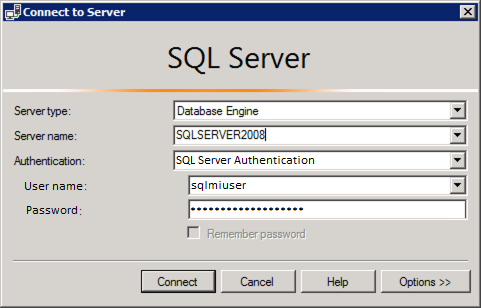

#  LAB 1: 利用 Azure SQL Database 受控執行個體上雲

- 評估資料庫的遷移
  - [任務 1. 在 SqlServer 2008 虛擬機器中設定 TailspinToys 資料庫](#任務-1-在-SqlServer-2008-虛擬機器中設定-TailspinToys-資料庫)
  - [任務 2. 使用 Data Migration Assistant DMA 評估遷移至 Azure SQL Database](#任務-2-使用-Data-Migration-Assistant-DMA-評估遷移至-Azure-SQL-Database)
  - [任務 3. 使用 Data Migration Assistant DMA 評估遷移至 Azure SQL Database Managed Instance](#任務-3-使用-Data-Migration-Assistant-DMA-評估遷移至-Azure-SQL-Database-Managed-Instance)
- 遷移至 Azure SQL Database Managed Instance
  >在此練習中我們將使用在線遷移的方式，以求減少停機時間。
  - [任務 4. 在 SqlServer2008 虛擬機器上建立網路分享](#任務-4-在-SqlServer2008-虛擬機器上建立網路分享)
  - [任務 5. 更改 MSSQLSERVER 服務以在 sqlmiuser 帳戶下執行](#任務-5-更改-MSSQLSERVER-服務以在-sqlmiuser-帳戶下執行)
  - [任務 6. 備份 TailspinToys 資料庫](#任務-6-備份-TailspinToys-資料庫)
  - [任務 7. 檢視 Azure SQL Database Managed Instance 與 SQL Server 2008 虛擬機器連接訊息](#任務-7-檢視-Azure-SQL-Database-Managed-Instance-與-SQL-Server-2008-虛擬機器連接訊息)
  - [任務 8. 創建服務主體](#任務-8-創建服務主體)
  - [任務 9. 建立與執行線上遷移專案](#任務-9-建立與執行線上遷移專案)
  - [任務 10. 執行遷移](#任務-10-執行遷移)
  - [任務 11. 驗證資料庫遷移](#任務-11-驗證資料庫遷移)
- 遷移應用程式至 Azure
  >在此練習中，會將應用程式部署至 App Service，並設定 P2S VPN 連線，以連接 Azure SQL Database Managed Instance 的資料庫
  - [任務 12. 部署網頁應用程式](#任務-12-部署網頁應用程式)
  - [任務 13. 更新網頁應用程式設定](#任務-13-更新網頁應用程式設定)
  - [任務 14. 設定 P2S VPN](#任務-14-設定-P2S-VPN)
  - [任務 15. 設定虛擬網路以整合 App Service](#任務-15-設定虛擬網路以整合-App-Service)
  - [任務 16. 瀏覽網頁應用程式](#任務-16-瀏覽網頁應用程式)


## 任務 1. 在 SqlServer 2008 虛擬機器中設定 TailspinToys 資料庫

### 1. 在 [Azure portal](https://portal.azure.com/) 中點選資源群組


### 2. 選擇 hands-on-lab 資源群組


### 3. 在資源清單中選擇 SqlServer2008 虛擬機器


### 4. 在虛擬機器介面中，點選左側的概觀，並點選連接按鈕


### 5. 在下拉選單中選擇下載 RDP 檔案，並執行


### 6. 在對話視窗中點選連接按鈕


### 7. 輸入 Username 與 Password 遠端登入

- **Username**: `sqlmiuser`
- **Password**: `Password.1234567890`


### 8. 在對話視窗中點選連接按鈕點選 Yes 按鈕


### 9. 啟動 Microsoft SQL Server Management Studio 17


### 10. 使用 SQL Server Authentication 登入

- **Username**: `sqlmiuser`
- **Password**: `Password.1234567890`




### 11. 點選 New Query 按鈕


### 12. 執行以下 SQL 指令將復原模式改為 FULL

```sql
USE master;
GO

-- Update the recovery model of the database to FULL and enable Service Broker
ALTER DATABASE TailspinToys SET
RECOVERY FULL,
ENABLE_BROKER WITH ROLLBACK IMMEDIATE;
GO
```


### 13. 執行


## 任務 2. 使用 Data Migration Assistant DMA 評估遷移至 Azure SQL Database

### 1. 啟動 Microsoft Data Migration Assistant


### 2. 新增專案


### 3. 輸入與選擇必要資訊


- **Project type**: Select **Assessment**.
- **Project name**: Enter `ToAzureSqlDb`
- **Assessment type**: Select **Database Engine**.
- **Source server type**: Select **SQL Server**.
- **Target server type**: Select **Azure SQL Database**.


### 4. 點選 Create 按鈕


### 5. 勾選 Check database compatibility、Check feature parity 並點選 Next


### 6. 輸入必要連線資訊

- **Server name**: Select **SQLSERVER2008**.
- **Authentication type**: Select **SQL Server Authentication**.
- **Username**: Enter `WorkshopUser`
- **Password**: Enter `Password.1234567890`
- **Encrypt connection**: Check this box.
- **Trust server certificate**: Check this box.


### 7. 點選連接


### 8. 勾選 TailspinToys 資料庫，並點選 Add


### 9. 點選 Start Assessment


### 10. 檢視遷移至 *Azure SQL Database* 的評估結果


>由結果可知 Azure SQL Database 並不支援兩項在地端 TailspinToys 資料庫中所使用的兩項功能即：<br>1. *跨資料庫查詢*<br>2. *Service Broker*<br>如果非得遷移到 Azure SQL Database 就必須針對資料庫修改。


## 任務 3. 使用 Data Migration Assistant DMA 評估遷移至 Azure SQL Database Managed Instance

透過檢視 Data Migration Assistant 的評估報告後，可得知有兩項功能不支援。但我們有另外一個選擇，就是 *Azure SQL Database Managed Instance* 。請再次使用 Data Migration Assistant 評估遷移至 *Azure SQL Database Managed Instance* 。


### 1. 新增專案


### 2. 輸入與選擇必要資訊


- **Project type**: Select **Assessment**.
- **Project name**: Enter `ToSqlMi`
- **Assessment type**: Select **Database Engine**.
- **Source server type**: Select **SQL Server**.
- **Target server type**: Select **Azure SQL Database Managed Instance**.


### 3. 點選 Create 按鈕


### 4. 勾選 Check database compatibility、Check feature parity 並點選 Next


### 5. 輸入必要連線資訊

- **Server name**: Select **SQLSERVER2008**.
- **Authentication type**: Select **SQL Server Authentication**.
- **Username**: Enter `WorkshopUser`
- **Password**: Enter `Password.1234567890`
- **Encrypt connection**: Check this box.
- **Trust server certificate**: Check this box.


### 6. 點選連接


### 7. 勾選 TailspinToys 資料庫，並點選 Add


### 8. 點選 Start Assessment


### 9. 檢視遷移至 *Azure SQL Database Managed Instance* 的評估結果


>由結果可知地端 TailspinToys 資料庫中所使用的功能在 Azure SQL Database Managed Instance 都有支援。<br>除此之外還有提供全文檢索的功能，但這並不會影響 TailspinToys 資料庫遷移到 Azure SQL Database Managed Instance。


## 任務 4. 在 SqlServer2008 虛擬機器上建立網路分享

在此任務中將會在 SqlServer2008 虛擬機器上建立網路分享(SMB)，此分享將被 Data Migration Service 用來將地端 TailspinToys 資料庫遷移至 Azure SQL Database Managed Instance，如此可減少停機時間。


### 1. 在 SqlServer2008 虛擬機器啟動檔案管理員


### 2. 在電腦 Windows (C:) 中新增名為 dms-backups 的資料夾


### 3. 在名為 dms-backups 的資料夾點擊右鍵，在選單選擇 Share with 與 Specific people


### 4. 在對話視窗中確定 sqlmiuser 具備讀寫權限，並點選 Share


### 5. 在對話視窗中點選 No, make the network that I am connected to a private network


### 6. 在對話視窗中檢視並記下分享資料夾的路徑 `\\SQLSERVER2008\dms-backups` ，並點選 Done


## 任務 5. 更改 MSSQLSERVER 服務以在 sqlmiuser 帳戶下執行

在此任務中，將使用 SQL Server Configuration Manager 變更 SQL Server (MSSQLSERVER) 的使用帳戶為 `sqlmiuser `，以求 SQL Server service 具備充分的權限。


### 1. 在 SqlServer2008 虛擬機器中啟動 SQL Server Configuration Managed


> **注意**: 請選擇 **SQL Server Configuration Manager**, 而非 **SQL Server 2017 Configuration Manager**，SQL Server 2017 Configuration Manager 不適用 SQL Server 2008 R2 資料庫。


### 2. 在對話視窗左側選單中選擇 SQL Server Services ，並在右側選單右鍵點擊 SQL Server (MSSQLSERVER) 並選擇 Properties 


### 3. 在對話視窗中選擇 This account 並輸入必要資訊

- **Account name**: `sqlmiuser`
- **Password**: `Password.1234567890`


### 4. 點選 OK


### 5. 點選 YES


### 6. 確認登錄身分已變更為 `./sqlmiuser`


### 7. 關閉對話視窗


## 任務 6. 備份 TailspinToys 資料庫


### 1. 啟動 Microsoft SQL Server Management Studio 17


### 2. 使用 SQL Server Authentication 登入

- **Username**: `sqlmiuser`
- **Password**: `Password.1234567890`


### 3. 展開資料庫並在 TailspinToys 資料庫右鍵點擊，在選單中選擇 Tasks，之後選擇 Back up


### 4. 在對話視窗中移除原本的路徑 `C:\TailspinToys.bak`


### 5. 加入新的路徑，並將路徑指定為先前建立的分享資料夾，檔案名稱命名為 TailspinToys.bak

- **完整路徑**: `C:\dms-backups\TailspinToys.bak`


### 6. 在對話視窗裝點選 `...` 


### 7. 選擇 `C:\dms-backups` 資料夾並輸入檔名 `TailspinToys.bak`，然後按下 OK


### 8. 點選 OK


### 9. 點選 Media Options 後，選擇 Back up to the existing media set 並勾選 Perform checksum before writing to media


### 10. 點選 OK 開始備份


### 11. 當備份完成你會看到以下訊息，點選 OK


## 任務 7. 檢視 Azure SQL Database Managed Instance 與 SQL Server 2008 虛擬機器連接訊息

在此任務中，我們將會使用 Azure Cloud Shell 檢視 Database Migration Service 連接 SqlServer2008 虛擬機器的必要資訊


### 1. 在 [Azure portal](https://portal.azure.com/) 點選 Azure Cloud Shell 圖示


### 2. 選擇 PowerShell


### 3. 若無任何儲存體，請新增一個


### 4. 等待數分鐘後，即可使用 Cloud Shell


### 5. 鍵入以下指令，並將 `<your-resource-group-name>` 替換成你的資源群組名稱

```powershell
$resourceGroup = "<your-resource-group-name>"
az vm list-ip-addresses -g $resourceGroup -n SqlServer2008 --output table
```


### 6. 你將會看到以下訊息，請將 `PublicIpAddresses` 底下的 `ipAddress` 記下


### 7. 將 Azure Cloud Shell 保持開啟以進行下一個任務


## 任務 8. 創建服務主體

在此任務中，將使用 Azure Cloud Shell 創建 Azure Active Directory(Azure AD)應用程序和服務主體，以確保 Data Migration Service 有足夠的權限訪問 Azure SQL Database Managed Instance 的 DMS 訪問。將向 hands-on-lab 資源群組和訂閱授予權限。

### 1. 輸入以下指令取得訂閱 ID 

```powershell
az account list --output table
```


### 2. 在輸出的資訊中找到用於此實驗的訂閱ID，並輸入以下指令，請將 `<your-subscription-id>` 替換為訂閱ID

```powershell
$subscriptionId = "<your-subscription-id>"
```


### 3. 輸入以下指令取得訂閱資訊

```powershell
az ad sp create-for-rbac -n "tailspin-toys" --role owner --scopes subscriptions/$subscriptionId/resourceGroups/$resourceGroup
```


### 4. 記錄 `appId` 與 `password `


### 5. 在 hands-on-lab 的資源群組中點選左側 Access control (IAM)，並點選 Role assignments，在列表中找到 tailspin-toys


### 6. 輸入以下指令在訂閱創建 CONTRIBUTOR 角色

```powershell
az role assignment create --assignee http://tailspin-toys --role contributor
```


## 任務 9. 建立與執行線上遷移專案

### 1. 在 [Azure portal](https://portal.azure.com/) 中點選 hands-on-lab 資源群組，再點選 tailspin-dms


### 2. 在 Azure Database Migration Service 頁面上側點選 New Migration Project.


### 3. 輸入以下資訊

- **Project name**: 輸入 `OnPremToSqlMi`
- **Source server type**: 選擇 **SQL Server**.
- **Target server type**: 選擇 **Azure SQL Database Managed Instance**.
- **Choose type of activity**: 選擇 **Online data migration** 並選擇 **Save**.


### 4. 點選 Create and run activity


### 5. 在 Select source 選項中輸入資訊

- **Source SQL Server instance name**: 輸入先前紀錄的 SqlServer2008 VM IP, 如 `13.66.228.107`
- **Authentication type**: 選擇SQL驗證
- **Username**: 輸入 `WorkshopUser`
- **Password**: 輸入 `Password.1234567890`
- **Connection properties**: 勾選 Encrypt connection 與 Trust server certificate


### 6. 選擇 Save

### 7. 在 Select target 選項中輸入資訊

- **Application ID**: 輸入先前記錄之 `appId`
- **Key**: 輸入先前記錄之 `password`
- **Subscription**: 選擇你的訂閱
- **Target Azure SQL Managed Instance**: 選擇 sqlmi
- **SQL Username**: Enter `sqlmiuser`
- **Password**: Enter `Password.1234567890`


### 8. 選擇 Save


### 9. 在 Select databases 選項中選擇 TailspinToys


### 10. 選擇 Save


### 11. 在 Configure migration settings 選項中輸入資訊

- **Network share location**: 輸入 SQLSERVER2008 VM 上的分享路徑 `\\SQLSERVER2008\dms-backups`
- **Windows User Azure Database Migration Service impersonates to upload files to Azure Storage**: 輸入 `SQLSERVER2008\sqlmiuser`
- **Password**: Enter `Password.1234567890`
- **Subscription containing storage account**: 選擇訂閱帳號
- **Storage account**: 選擇 **sqlmistore** storage account.


### 12. 選擇 Save


### 13. 在 Summary 選項中輸入資訊

- **Activity name**: 輸入 TailspinToysMigration.


### 14. 選擇 Run migration


### 15. 點選上方 Refresh 以更新狀態


### 16. 更新狀態直至 Log shipping in progress


## 任務 10. 執行遷移

### 1. 在遷移狀態視窗中選擇 TailspinToys 以獲得更多訊息


### 2. 在 TailspinToys 中確認 TailspinToys.bak 狀態為 Restored


### 3. 為了檢視資料庫遷移的過程，我們將新增一筆資料


### 4. 在 SqlServer2008 虛擬機器啟動 SSMS 並點選 New Query


### 5. 將以下指令貼到新的 query 視窗

```sql
USE TailspinToys;
GO

INSERT [dbo].[Game] (Title, Description, Rating, IsOnlineMultiplayer)
VALUES ('Space Adventure', 'Explore the universe with are newest online multiplayer gaming experience. Build custom  rocket ships, and take off for the stars in an infinite open-world adventure.', 'T', 1)
```


### 6. 執行指令新增資料到 Game table


### 7. 新增資料後再次備份，Data Migration Service 會檢查更新，並移至 Migration Service 中，點選 New Query 執行以下指令進行備份
>注意，這次只備份交易紀錄

```sql
USE master;
GO

BACKUP LOG TailspinToys
TO DISK = 'c:\dms-backups\TailspinToysLog.trn'
WITH CHECKSUM
GO
```


### 8. 回到 Azure Portal 中檢視遷移狀態，點選更新按鈕以獲得最新資訊，並可以看到 TailspinToysLog.trn 檔案狀態為已上傳


>若你尚未 TailspinToysLog.trn 請重新整理直至項目出現為止


### 9. 當 TailspinToysLog.trn 檔案上傳後會開始還原，請繼續更新直到狀態為已還原，耗時約數分鐘


### 10. 當 TailspinToysLog.trn 狀態為已還原後，點選 Start Cutover


### 11. 在對完成切換的話視窗中檢視資訊，待還原的 Log 數為 `0`，勾選確認並接受


### 12. 在對話視窗下方有進度條，點選 `X` 關閉視窗


### 13. 在頁面中檢視 TailspinToys 還原狀態，持續更新直至已完成


### 14. 恭喜你已經將地端 TailspinToys 資料庫遷移至 Azure SQL Managed Instance


## 任務 11. 驗證資料庫遷移

### 1. 請在 [Azure Portal](https://portal.azure.com/) 中開啟 Azure Cloud Shell


### 2. 點選 PowerShell


### 3. 經過數分鐘後就可以使用 PowerShell


### 4. 輸入以下指令，並將 `<your-resource-group-name>` 替換為你的資源群組名稱

```powershell
$resourceGroup = "<your-resource-group-name>"
az sql mi list --resource-group $resourceGroup
```

### 5. 在 PowerShell 中檢視資料庫位置


### 6. SqlServer2008 虛擬機器的 SQL Server Management Studio中，新增連接


### 7. 在對話視窗中輸入連接資訊

- **Server name**: Enter the fully qualified domain name of your SQL managed instance, which you copied from the Azure Cloud Shell in the previous steps.
- **Authentication**: Select **SQL Server Authentication**.
- **Login**: Enter `sqlmiuser`
- **Password**: Enter `Password.1234567890`
- Check the **Remember password** box.


### 8. 點選 Connect


### 9. 點選 Azure SQL Database Managed Instance 連線中的 TailspinToys 資料庫


### 10. 執行以下命令檢視資料

```sql
USE TailspinToys;
GO

SELECT * FROM Game
```


### 11. 執行命令後可看到後來新增的資料


## 任務 12. 部署網頁應用程式

### 1. 在 [Azure Portal](https://portal.azure.com/) 中尋找資源群組


### 2. 在點選 JumpBox 虛擬機器


### 3. JumpBox 虛擬機器頁面上方點選連接並選擇 RDP


### 4. 下載 RDP 檔案


### 5. 在對話視窗中點選連接按鈕


### 6. 輸入 Username 與 Password 遠端登入
- **Username**: `sqlmiuser`
- **Password**: `Password.1234567890`


### 7. 在對話視窗中點選連接按鈕點選 Yes 按鈕


### 8. 開啟檔案管理員


### 9. 在 `C:\hands-on-lab\MCW-Migrating-SQL-databases-to-Azure-master\Hands-on lab\lab-files` 路徑中，雙擊 TailspinToysWeb.sln


### 10. 若顯示詢問對話框，點選 Visual Studio 2019 後，點選OK


### 11. 以 Azure account 登入


### 12. 在對話視窗中勾選 `Ask me for every project in this solution` 並點選OK


### 13. 在 Visual Studio 中，右鍵點選 TailspinToysWeb 專案，並點選 `Publish`


### 14. 在對話視窗中點選 App Service ，然後選擇 Select Existing ，並點選 Create Profile


### 15. 選擇 tailspintoys App Service


### 16. 選擇 OK


### 17. 點選 Publish


### 18. 當部署完成，可以在 Visual Studio 下方的輸出訊息中看到應用程式網址


### 19. 當你點選該網址會看到以下錯誤訊息，是因為還沒設定點為連接 Azure SQL Database Managed Instance 


## 任務 13. 更新網頁應用程式設定

### 1. 在 [Azure Portal](https://portal.azure.com/) 點選資源群組


### 2. 點選練習的資源群組 


### 3.  點選 tailspintoys App Service


### 4.  在左側選單中點選 Configuration


### 5.  點選 `TailspinToysContext` 右側的設定 icon


### 6.  將以下連接字串 `<your-sqlmi-host-fqdn-value>` 替換為你的 Azure SQL Database Managed Instance 資料庫位置，作為連線字串

```sql
Server=tcp:<your-sqlmi-host-fqdn-value>,1433;Database=TailspinToys;User ID=sqlmiuser;Password=Password.1234567890;Trusted_Connection=False;Encrypt=True;TrustServerCertificate=True;
```


### 7. 對話視窗中修改連線字串，再次提醒將 `<your-sqlmi-host-fqdn-value>` 替換為你的 Azure SQL Database Managed Instance 資料庫位置


>看起來會像這樣


### 8. 點選 OK


### 9. 將 `TailspinToysReadOnlyContext` 進行相同的設定


### 10. 點選上方的 Save 按鈕


### 11. 點選 Continue


### 12. 在左側選單中點選 Overview


### 13. 瀏覽 URL 會看到以下錯誤訊息，因為 Azure SQL Database Managed Instance 存在隔離的虛擬網路之中


## 任務 14. 設定 P2S VPN

### 1. 在 [Azure Portal](https://portal.azure.com/) 資源群組中點選 hands-on-lab-vnet-gateway


### 2. 在左側選單中點選 Point-to-site configuration，並點選右側的 Configure now


### 3. 在 P2S 設定頁面中輸入以下資訊

- **Address pool**: 輸入要設定的 IP 地址範圍，應位於以下其中一項，但不應與虛擬網路使用的範圍重複
  - `10.0.0.0/8` - 這表示IP地址範圍從 10.0.0.0 到 10.255.255.255
  - `172.16.0.0/12` - 這表示IP地址範圍從 172.16.0.0 到 172.31.255.255
  - `192.168.0.0/16` - 這表示IP地址範圍從 192.168.0.0 到 192.168.255.255
- **Tunnel type**: 選擇 **SSTP(SSL)**.
- **Authentication type**: 選擇 **Azure certificate**.


### 4. 點選 Save 儲存設定


## 任務 15. 設定虛擬網路以整合 App Service

### 1. 在 [Azure Portal](https://portal.azure.com/) 資源群組中點選 tailspintoys App Service


### 2. 在左側選單中點選 Networking ，並點選右側 Click here to configure


### 3. 點選 Add VNet


### 4. 在對話視窗選擇虛擬網路


### 5. 更新設定需要一些時間，請點選 Refresh 更新狀態，直至 Certificate sync


>若收到新增失敗的訊息，請點選 Disconnect 再重新新增


## 任務 16. 瀏覽網頁應用程式

### 1. 在 App Service 概觀頁面中點選 URL 即可瀏覽頁面


### 2. 檢視成果


>若收到錯誤訊息，請持續重新整理


### 3. 恭喜！你的應用程式已成功連接 Azure SQL Database Managed Instance 
