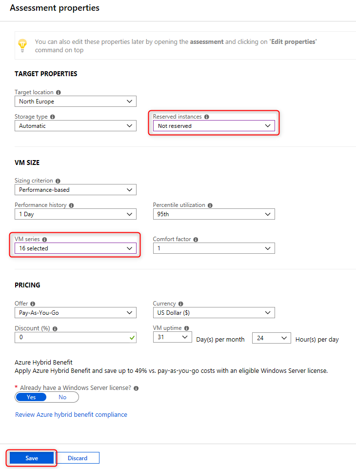

#  LAB 2: 將企業營運應用程式上雲

- 評估遷移
  - [任務 1. 建立 Azure Migrate 專案與工具](#任務-1-建立-azure-migrate-專案與工具)
  - [任務 2. 部署 Azure Migrate appliance](#任務-2-部署-Azure-Migrate-appliance)
  - [任務 3. 設定 Azure Migrate appliance](#任務-3-設定-Azure-Migrate-appliance)
  - [任務 4. 建立評估](#任務-4-建立評估)
  - [任務 5. 安裝代理程式](#任務-5-安裝代理程式)
  - [任務 6. 以視覺介化面檢視依賴關係](#任務-6-以視覺介化面檢視依賴關係)
- 資料庫遷移至 Azure
  - [任務 7. 遷移資料庫](#任務-7-遷移資料庫)
  - [任務 8. 建立 Azure SQL Database](#任務-8-建立-Azure-SQL-Database)
  - [任務 9. 建立 Database Migration Service](#任務-9-建立-Database-Migration-Service)
  - [任務 10. 在地端機器中使用 Data Migration Assistant](#任務-10-在地端機器中使用-Data-Migration-Assistant)
  - [任務 11. 建立 DMS 遷移專案](#任務-11-建立-DMS-遷移專案)
  - [任務 12. 遷移資料庫綱要](#任務-12-遷移資料庫綱要)
  - [任務 13. 遷移資料](#任務-13-遷移資料)
- 應用程式遷移至 Azure
  - [任務 14. 建立 Storage Account](#任務-14-建立-Storage-Account)
  - [任務 15. 建立虛擬網路](#任務-15-建立虛擬網路)
  - [任務 16. 註冊 Hyper-V 主機](#任務-16-註冊-Hyper-V-主機)
  - [任務 17. 啟用複寫](#任務-17-啟用複寫)
  - [任務 18. 為每台虛擬機器分配內部靜態 IP](#任務-18-為每台虛擬機器分配內部靜態-IP)
  - [任務 19. 伺服器遷移](#任務-19-伺服器遷移)
  - [任務 20. 啟用 Azure Bastion](#任務-20-啟用-Azure-Bastion)
  - [任務 21. 設定資料庫連線](#任務-21-設定資料庫連線)
  - [任務 22. 分配公有 IP 並測試應用程式](#任務-22-分配公有-IP-並測試應用程式)


## 任務 1. 建立 Azure Migrate 專案與工具

### 1. 在 [Azure portal](https://portal.azure.com/) 中搜尋 Azure Migrate 資源


### 2. 點選 Assess and migrate servers 並點選 Add tool(s

- **Resource group**: `AzureMigrateRG`
- **Subscription**: `<your Subscription>`
- **Geography**: `<Geography>`


點選 `Next`


### 3. 選擇 Azure Migrate: Server Assessment 並點選 下一步


### 4. 選擇 Azure Migrate: Server Migration 並點選 下一步


### 5. 點選 Add tool(s)


## 任務 2. 部署 Azure Migrate appliance

### 1. 在搜尋列尋找 SmartHotelHost 虛擬機器


### 2. 點選連接，並選擇 RDP 並下載 RDP 檔案，當下載完畢後執行 RDP 檔案連線至 SmartHotelHost 虛擬機器

- **Username**: `demouser`
- **Password**: `demo!pass123`


### 3. 在 Server Manager 點選 Tools，並在列表中點選 Hyper-V Manager


### 4. 在 Hyper-V Manager 中點選 Import Virtual Machine


### 5. 點選下一步


### 6. 選擇 F:\VirtualMachines\AzureMigrateAppliance(會包含版號)，選擇該資料夾後點選下一步


### 7. 在 Select Virtual Machine 點選下一步


### 8. 在 Choose Import Type 點選下一步


### 9. 在 Connect Network 中，選擇 Azure Migrate Switch 並點選下一步


### 10. 點選 Finish


### 11. 點選 AzureMigrateAppliance 虛擬機器，並點選右邊的 Start


## 任務 3. 設定 Azure Migrate appliance

### 1. 點選 AzureMigrateAppliance 虛擬機器，並點選右邊的 connect


### 2. 點選 Accept


### 3. 以 demo!pass123 作為密碼，並點選 Finish


### 4. 設定畫面大小，並點選 Connect


### 5. 以 demo!pass123 作為密碼登入 Administrator


### 6. 登入後等待數分鐘，Internet Explorer 將自動開啟以呈現 Azure Migrate appliance 設定精靈，若出現提示視窗，點選 OK 同意安裝 Internet Explorer 11，並關閉警告


### 7. 在 Set up prerequisites 步驟中接受授權條款並勾選確認框，接下來的兩個步驟會自動完成


### 8. 此後將會自動更新 Azure Migrate，期間將會要求登入請以`Administrator` 為帳號 `demo!pass123` 為密碼登入，若提示出現重新啟動，請重新啟動，並點選 Continue


### 9. 在 Register with Azure Migrate 中，點選登入 Login


### 10. 輸入必要資訊並點選 Continue


### 11. 在 Provide Hyper-V hosts details 中，輸入必要資訊，並點選 Save details

- **Username**: `demouser`
- **Password**: `demo!pass123`


### 12. 點選 Add


### 13. 輸入 `SmartHotelHost` 並點選 Validate


### 14. 在 Status 之下看到綠色標誌後再點選 Validate 一次，點選 Save and start discovery

### 15. 等待數分鐘已完成程序


>等待數分鐘 ......


### 16. 在 [Azure portal](https://portal.azure.com/) 中瀏覽 Azure Migrate 頁面，並點選左側的 Servers，然後再上方點選 Refresh，直到 Azure Migrate: Server Assessment 中的探索項目數量更新為 5


## 任務 4. 建立評估

### 1. 在 Azure Migrate 頁面 Azure Migrate: Server Assessment 中，點選 Assess


### 2. 在 Azure Migrate 頁面 Azure Migrate: Server Assessment 中，點選 Assess ，以 SmartHotelAssessment 作為 assessment name，並點選 View all


### 3. 在 VM series 選擇全部，並在 Reserved instances 選擇不保留，點選 Save




### 4. 選擇 create a group，群組名稱輸入 SmartHotel VMs，並選擇 smarthotelweb1, smarthotelweb2 及 UbuntuWAF 虛擬機器，最後選擇 Create assessment


### 5. 在 Azure Migrate - Servers 頁面點選 Refresh ，直至 assessments 的數字顯示為 1


## 任務 5. 安裝代理程式

### 1. 在 Azure Migrate - Servers 頁面點選右側 Azure Migrate: Server Assessment 之下的 Groups，並點選 SmartHotel VMs 群組，檢視訊息，每台虛擬機器皆需要安裝代理程式，在 smarthotelweb1 虛擬機器右側點選 Requires agent installation


### 2. 點選 Configure OMS workspace


### 3. 以 AzureMigrateWorkspace<unique number> 作為 workspace 名稱，並選擇區域，最後點選 Configure


### 4. 等待數分鐘後，移至建立的 workspace ，點選進階設定，並紀錄 Workspace ID 與 Primary Key


### 5. 將網址複製


### 6. 返回遠端桌面，連至 smarthotelweb1 虛擬機器


### 7. 再次點選連線，並以 `Administrator` 與 `demo!pass123` 登入

### 8. 開啟 Internet Explorer，並將連結至網址列，你可能會被要求登入，選擇 64 位元的下載連結

>若 Internet Explorer 無法載入，你將需要在虛擬機器中安裝 Chrome ，並以 Chrome 操作


### 9. 開啟安裝程式，並在 Agent Setup Options 頁選擇 Connect the agent to Azure Log Analytics (OMS) 並點選 Next，並輸入先前複製的 Workspace ID 與 Workspace Key，然後在 Azure Cloud 下拉選單選擇 Azure Commercial，剩餘步驟使用預設值完成安裝


### 10. 使用以下連結在 smarthotelweb1 虛擬機器下載第二個代理程式，並通過精靈完成安裝

> https://aka.ms/dependencyagentwindows


### 11. 關閉 smarthotelweb1 視窗，並連至 smarthotelweb2 虛擬機器，重複 9、10 安裝兩個代理程式


### 12. 關閉 smarthotelweb2 視窗，並在 SmartHotelHost 遠端桌面中開啟 CMD
>為了要在 UbuntuWAF 虛擬機器安裝代理程式


### 13. 輸入以下命令連接到 SmartHotelHost 上 Hyper-V 中運行的 UbuntuWAF 虛擬機器

```bash
ssh demouser@192.168.0.8
```


### 14. 當顯示是否連接時，輸入 yes，並以 demo!pass123 為密碼連接


### 15. 輸入以下指令並以 demo!pass123 為密碼變更權限

```s
sudo -s
```


### 16. 輸入以下指令，並將其中的 <Workspace ID> 與 <Workspace Key> 替換為之前複製的 Workspace ID 與 Workspace Key

```s
wget https://raw.githubusercontent.com/Microsoft/OMS-Agent-for-Linux/master/installer/scripts/onboard_agent.sh && sh onboard_agent.sh -w <Workspace ID> -s <Workspace Key>
```


### 17. 輸入以下指令，並將其中的 <Workspace ID> 替換為之前複製的 Workspace ID

```s
/opt/microsoft/omsagent/bin/service_control restart <Workspace ID>
```


### 18. 輸入以下指令

```s
wget --content-disposition https://aka.ms/dependencyagentlinux -O InstallDependencyAgent-Linux64.bin
```


### 19. 輸入以下指令

```s
sh InstallDependencyAgent-Linux64.bin -s
```


### 20. 完成安裝代理程式


## 任務 6. 以視覺介化面檢視依賴關係

### 1. 更新 Azure portal 中 SmartHotel VMs 群組頁面(重新整理整個瀏覽器)，可看到狀態更新為已安裝


### 2. 點選上方的 View dependencies 可檢視依賴關係


## 任務 7. 遷移資料庫

### 1. 移至 [https://shell.azure.com](https://shell.azure.com) 創建儲存體並選擇 PowerShell


### 2. 輸入以下指令註冊 Microsoft.DataMigration 資源提供者

```PowerShell
Register-AzResourceProvider -ProviderNamespace Microsoft.DataMigration
```

>這將會需要數分鐘，你可以繼續進行以下動作，而不必等待完成，直到任務 9

>你可以使用以下指令檢視註冊狀態

> ```PowerShell
> Get-AzResourceProvider -ProviderNamespace Microsoft.DataMigration | Select-Object ProviderNamespace, RegistrationState, ResourceTypes


## 任務 8. 建立 Azure SQL Database

### 1. 登入 [Azure Portal](https://portal.azure.com/)


### 2. 尋找 SQL Database 資源並點選建立


### 3. 以 Basics 為規格，並輸入以下資訊

- Subscription: **選擇你的訂閱**.

- Resource group (create new): **SmartHotelDBRG**

- Database name: **smarthoteldb**

- Server: Select **Create new** 輸入以下資訊並點選 **OK**:

    - Server name: **smarthoteldb\[unique number\]**

    - Server admin login: **demouser**

    - Password: **demo!pass123**

    - Location: **選擇與實驗相同的區域以便加速遷移**

- Use SQL elastic pool: **No**

- Compute + storage: **Standard S0**


### 4. 點選 Next: Networking 確認沒有任何訪問權限


### 5. 點選  Review + Create 並點選 Create


## 任務 9. 建立 Database Migration Service

### 1. 在 PowerShell 中輸入以下指令，確認資源提供者已註冊完成

```PowerShell
Get-AzResourceProvider -ProviderNamespace Microsoft.DataMigration | Select-Object ProviderNamespace, RegistrationState, ResourceTypes
```


### 2. 在 [Azure portal](https://portal.azure.com/) 尋找並點選 Azure Database Migration Service，最後點選 Create


### 3. 輸入必要資訊

- Subscription: **選擇你的訂閱**.

- Resource group: **AzureMigrateRG**

- Service Name: **SmartHotelDBMigration**

- Location: **選擇 SmartHotel host 所在區域**.

- Pricing tier: **Standard: 1 vCore**


### 4. 點選 Next: Networking ，選擇 SmartHotelHostRG 資源群組中的 DMSvnet/DMS 虛擬網路和子網路


### 5. 點選 Review + create 並點選 Create


## 任務 10. 在地端機器中使用 Data Migration Assistant

### 1. 在 Azure Migrate 頁面中點選 Overview 並點選 Assess and migrate databases 按鈕


### 2. 點選 Add tool(s)


### 3. 在 Select assessment tool 步驟中，點選 Azure Migrate: Database Assessment 並點選 Next


### 4. 在 Select migration tool 步驟中，點選 Azure Migrate: Database Migration 並點選 Next


### 5. 點選 Add tool(s)


### 6. 完成部署後，在左側選單中點選 Azure Migrate - Databases，並點選右側 + Assess


### 7. 點選 Download 開啟下載頁面，並複製 URL


### 8. 開啟 SmartHotelHost 虛擬機器遠端桌面，開啟 Chrome 瀏覽器，並在網址列貼上 URL 以下載 Data Migration Assistant


### 9. 在 SmartHotelHost 虛擬機器遠端桌面中開啟檔案總管，並移至 C:\Program Files\Microsoft Data Migration Assistant 資料夾，並以記事本開啟 Dma.exe.config 檔案，搜尋 AzureMigrate 刪除 <!-- 與 --> 符號以取消註解


### 10. 在 SmartHotelHost 虛擬機器遠端桌面中，藉由桌面 icon 開啟 Microsoft Data Migration Assistant


### 11. 在 Data Migration Assistant 程式中點選 + icon，並輸入以下資訊，最後點選 Create

- Project type: **Assessment**

- Project name: **SmartHotelAssessment**

- Assessment type: **Database Engine**

- Source server type: **SQL Server**

- Target server type: **Azure SQL Database**


### 12. 點選下一步


### 13. 輸入以下連線資訊，並點選連線

- Server name: **192.168.0.6**

- Authentication type: **SQL Server Authentication**

- Username: **sa**

- Password: **demo!pass123**

- Encrypt connection: **勾選**

- Trust server certificate: **勾選**


### 14. 選擇 SmartHotel.Registration 並點選 Add


### 15. 點選 Start Assessment


### 16. 等待評估完成，雖然結果顯示有一項功能不支援，但在此練習中可忽略


### 17. 點選 Upload to Azure Migrate 將評估上傳至 Azure Migrate project 


### 18. 選擇你的訂閱與 Azure Migrate Project，並點選 Upload，最後點選 OK


### 19. 縮小遠端桌面連線，回到 Azure Migrate - Databases 頁面，重新整理能看到以評估的資料庫


## 任務 11. 建立 DMS 遷移專案

### 1. 在 [Azure portal](https://portal.azure.com/) 移至 SmartHotelHostDBRG 資源群組，然後移至 database server


### 2. 在 Security 類別中選擇 Firewalls and virtual networks，允許 Azure 服務與資源訪問此伺服器，並注意無公用 IP 授予伺服器


### 3. 在 Security 類別中選擇 Private endpoint connections，點選 + Private endpoint


### 4. 輸入以下資訊並點選 Next: Resource

- Resource group: **SmartHotelDBRG**

- Name: **SmartHotel-DB-for-DMS**

- Region: **選擇與 DMSvnet 相同的區域**


### 5. 輸入以下資訊並點選 Next: Configuration

- Connection method: **Connect to an Azure resource in my directory**.

- Subscription: **你的訂閱**.

- Resource type: **Microsoft.Sql/servers**

- Resource: **你的資料庫名稱**.

- Target sub-resource: **sqlServer**


### 6. 輸入以下資訊並點選 Review + create 然後點選 Create

- Virtual network: **DMSvnet**

- Subnet: **DMS (10.1.0.0/24)**

- Integrate with private DNS zone: **Yes**

- Private DNS zone: (default) **privatelink.database.windows.net**


### 7. 等待完成部署


### 8. 確認在 [任務 9.](#任務-9.-建立-Database-Migration-Service) 建立的 Database Migration Service 已完成，你可以在 AzureMigrateRG 資源群組的頁面，點選左邊的 Deployments 選項確認部署狀態


### 9. 在 AzureMigrateRG 資源群組頁面點選 Database Migration Service 資源，並點選 + New Migration Project


### 10. 在彈出的對話視窗中，以 DBMigrate 作為專案名稱，來源伺服器類別為 SQL Server，目標伺服器類別為 Azure SQL Database，並點選 Choose type of activity，選擇 Create project only 並點選 Save 與 Create


### 11. 在遷移精靈中，Select source 步驟中輸入與選擇以下資訊，並點選儲存

- Source SQL Server instance name: **10.0.0.4**

- Authentication type: **SQL Authentication**

- User Name: **sa**

- Password: **demo!pass123**

- Encryption connection: **Checked**

- Trust server certificate: **Checked**


### 12. 在 Select source databases 步驟中勾選 Smarthotel.Registration 並點選 Save


### 13. 在 Select target 步驟中輸入以下資訊並點選 Save

- Target server name: **你的資料庫伺服器位置，如：{something}.database.windows.net**

- Authentication type: **SQL Authentication**

- User Name: **demouser**

- Password: **demo!pass123**

- Encrypt connection: **Checked**


>資料庫伺服器位置可在 Azure portal 中資料庫概觀頁面取得


### 14. 在 Project summary 步驟中點選 Save 以建立遷移專案


## 任務 12. 遷移資料庫綱要

### 1. 在 Azure portal 中點選 DBMigrate 遷移專案，並點選上方的 + New Activity，然後在選單中點選 Schema only migration


### 2. 遷移精靈會自動帶入大部分必要資訊，在 Select source 步驟中，重新輸入密碼 `demo!pass123` 並點選 Save


### 3. 在 Select target 步驟中，輸入密碼 `demo!pass123` 並點選 Save


### 4. 在 Select database and schema 步驟中，確定 SmartHotel.Registration 已勾選，並在 Target Database 欄位選擇 smarthoteldb，然後在 Schema Source 欄位選擇 Generate from source，最後點選 Save


### 5. 在 Summary  步驟中，輸入 SchemaMigration 作為 Activity name，並選擇資料庫驗證選項，最後點選 Run migration 開始遷移


### 6. 持續點選 Refresh 直到狀態更新為已完成


## 任務 13. 遷移資料

### 1. 在 Azure portal 中點選 DBMigrate 遷移專案，並點選上方的 + New Activity，然後在選單中點選 Offline data migration


### 2. 遷移精靈會自動帶入大部分必要資訊，在 Select source 步驟中，重新輸入密碼 `demo!pass123` 並點選 Save


### 3. 在 Select target 步驟中，輸入密碼 `demo!pass123` 並點選 Save


### 4. 在 Map to target databases 步驟中，確定 SmartHotel.Registration 已勾選，並在 Target Database 欄位選擇 smarthoteldb 最後點選 Save


### 5. 在 Configure migration settings 步驟中，勾選 Bookings 並點選 Save


### 6. 在 Migration summary 步驟中，輸入 DataMigration 作為 Activity name，並選擇資料庫驗證選項，最後點選 Run migration 開始遷移


### 7. 持續點選 Refresh 直到狀態更新為已完成


>完成之後，我們將移除用於 DMS 訪問的私人端點連線，因資料庫遷移已完成，不在需要這種訪問權限


### 8. 在 Azure portal 移至 SmartHotelHostDBRG 資源群組，並點選資料庫伺服器，在左側選單中點選 Private endpoint connections


### 9. 勾選 SmartHotel-DB-for-DMS 並點選上方的 Remove


## 任務 14. 建立 Storage Account

### 1. 在 Azure portal 中點選建立資源，並點選左側選單中的 Storage，然後點選右側的 Storage account


### 2. 在 Basics 頁面中，輸入以下內容

- Subscription: **選擇你的訂閱**

- Resource group: **AzureMigrateRG**

- Storage account name: **migrationstorage\[unique number\]**

- Location: **注意: 選擇與你的 Azure SQL Database 相同位置**

- Account kind: **Storage (general purpose v1)**

- Replication: **Locally-redundant storage (LRS)**


### 3. 點選 Review + Create 並點選 Create


## 任務 15. 建立虛擬網路

### 1. 在 Azure portal 中點選建立資源，並點選左側選單中的 Networking，然後點選右側的 Virtual network


### 2. 輸入以下內容

- Subscription: **選擇你的訂閱**

- Resource group: (create new) **SmartHotelRG**

- Name: **SmartHotelVNet**

- Region: **注意: 選擇與你的 Azure SQL Database 相同位置**


### 3. 點選 Next: IP Addresses 並輸入以下資訊

- IPv4 address space: **192.168.0.0/24** 

- First subnet: 點選 **Add subnet** 並輸入以下資訊:

    - Subnet name: **SmartHotel**

    - Address range: **192.168.0.0/25**

    - Select **Add**

- Second subnet: 點選 **Add subnet** 並輸入以下資訊:

    - Subnet name: **SmartHotelDB**

    - Address range: **192.168.0.128/25**

    - Select **Add**


### 4. 點選 Review + Create 並點選 Create


### 5. 移至 SmartHotelHostDBRG 資源群組中的資料庫伺服器，在左側 Security 分類中點選 Private endpoint connections，並在右側點選 + Private endpoint


### 6. 在 Basics 頁面中，輸入以下內容，並點選 Next: Resource

- Resource group: **SmartHotelDBRG**

- Name: **SmartHotel-DB-Endpoint**

- Region: **選擇與 SmartHotelVNet 相同區域**


### 7. 在 Resource 頁面中，輸入以下內容，並點選 Next: Configuration

- Connection method: **Connect to an Azure resource in my directory**.

- Subscription: **選擇你的訂閱**.

- Resource type: **Microsoft.Sql/servers**

- Resource: **你的 SQL 資料庫伺服器名稱**.

- Target sub-resource: **sqlServer**


### 8. 在 Configuration  頁面中，輸入以下內容，並點選 Review + Create 並點選 Create

- Virtual network: **SmartHotelVNet**

- Subnet: **SmartHotelDB (192.168.0.128/25)**

- Integrate with private DNS zone: **Yes**

- Private DNS zone: (default) **privatelink.database.windows.net**


### 9. 等待部署完成


## 任務 16. 註冊 Hyper-V 主機

### 1. 在 Azure Portal 中點選 Azure Migrate，並點選選 Servers，然後在 Migration Tools 下點選 Discover


### 2. 在 Discover machines 頁面中，Are your machines virtualized 的下拉選單選擇 Yes, with Hyper-V，在 Target region 選擇與 Azure SQL Database 相同的位置，然後勾選 confirmation 確認框，最後點選 Create resources


### 3. 複製下載連結


### 4. 開啟 SmartHotelHost 遠端桌面，並在 Chrome 瀏覽器的網址列將複製的連結貼上並移往，瀏覽器會開始下載程式


### 5. 回到 Azure portal 的 Discover machines 頁面中，點選下載按鈕以下載金鑰檔


### 6. 將金鑰檔複製到剪貼簿中並在 SmartHotelHost 遠端桌面中貼上(貼在桌面)


### 7. 在 SmartHotelHost 遠端桌面中開啟使用 Chrome 瀏覽器下載的程式 AzureSiteRecoveryProvider.exe，在 Microsoft Update 步驟選擇 Off 並點選 Next，使用預設值完成安裝


### 8. 當安裝完成之後，點選 Register 並瀏覽金鑰檔位置，最後點選 Next


### 9. 選擇 Connect directly to Azure Site Recovery without a proxy server 並點選 Next


### 10. 等待註冊完成後點選 Finish


### 11. 將遠端桌面縮小，並回到 Azure Migrate 瀏覽視窗，重新整理瀏覽器，點選 Azure Migrate: Server Migration 下的 Discover，在 Are your machines virtualized 選擇 Yes, with Hyper-V，再次打開 Discover machines 頁面


### 12. 點選 Finalize registration


### 13. 等待註冊完成


### 14. 當註冊完成後，關閉 Discover machines 頁面


### 15. 在 Azure Migrate: Server Migration 下可看到 5 項已發現的伺服器


## 任務 17. 啟用複寫

### 1. 在 Azure Migrate: Server Migration 下點選 Replicate，以開啟 Replicate 精靈


### 2. 在 Source settings 分頁，在 Are your machines virtualized? 之下的下拉選單中，選擇 Yes, with Hyper-V，並點選 Next: Virtual machines


### 3. 在 Virtual machines 分頁，在 Import migration settings from an assessment 之下的下拉選單中，選擇 Yes, apply migration settings from an Azure Migrate assessment，選擇 SmartHotel VMs 虛擬機器群組，最後選擇 SmartHotelAssessment 評估


### 4. 選擇 UbuntuWAF、smarthotelweb1 及 smarthotelweb2 虛擬機器， 並點選 Next: Target settings


### 5. 在 Target settings 分頁中，選擇你的訂閱，並選擇現有資源群組 SmartHotelRG，選擇 migrationstorage 作為 Replication storage account，選擇 SmartHotelVNet 作為虛擬網路，選擇 SmartHotel 作為子網路，最後點選 Next: Compute


### 6. 在 Compute  分頁中，針對每個虛擬機器選擇 Standard_F2s_v2 規格，並將 smarthotelweb 虛擬機器的作業系統設定為 Windows ，再將 UbuntuWAF 的作業系統設定為 Linux，最後點選 Next: Disks

>注意：若你使用 Azure Pass 訂閱，將不被允許使用 FSv2 規格，請變更為 DS2_v2 或 D2s_v3 規格


### 7. 不做任何變更，點選 Next: Review + Start replication，點選 Replicate 開始複寫


### 8. 在 Azure Migrate 頁面左側，點選 Manage 分類中的 Replicating Machines，並持續點選上方的 Refresh 直到三台虛擬機器的狀態更新為 Protected


## 任務 18. 為每台虛擬機器分配內部靜態 IP

### 1. 在 Azure Migrate: Server Migration - Replicating machines 頁面，選擇 smarthotelweb1 虛擬機器


### 2. 點選 Compute and Network 並點選 Edit


### 3. 確認虛擬機器的規格為 F2s_v2 (若使用 Azure Pass 訂閱則為 DS2_v2 或 D2s_v3)，且 Use managed disks 設定為 Yes


### 4. 在 Network Interfaces 下點選 InternalNATSwitch


### 5. 在彈出的對話視窗中，將 Private IP address 變更為 192.168.0.4


### 6. 點選 OK 以關閉彈出的對話視窗，並點選 Save 


### 7. 重複 1-6 步驟以針對其他虛擬機器分配私有 IP

- **smarthotelweb2** 的私有 IP **192.168.0.5**

- **UbuntuWAF** 的私有 IP **192.168.0.8**


## 任務 19. 伺服器遷移

### 1. 回到 Azure Migrate: Server Migration 概觀頁面，在 Step 3: Migrate 方框下方點選 Migrate

>在實務中在正式遷移前應該要先測試遷移，但在此我們為了節省時間，所以直接進行遷移


### 2. 在 Migrate 頁面中，選取三台虛擬機器，並點選 Migrate


>你可以選擇在遷移前將地端電腦先關機，以減少資料的遺失，在此 LAB 中兩者都適用


### 3. 遷移程序會開始進行


### 4. 你可以在左側的選單中點選 Jobs 以監視遷移程序


### 5. 等待遷移程序完成


## 任務 20. 啟用 Azure Bastion

>我們要針對遷移至 Azure 的虛擬機器進行一些設定，但這些虛擬機器都沒有分配公有 IP，為了在不分配公有 IP 的情況下訪問虛擬機器，我們可以透過 Azure Bastion

>Azure Bastion 需要一個和虛擬機器處於相同虛擬網路的子網路，然而在 SmartHotelVNet 目前沒有可用的網路空間，故先擴展之

### 1. 移至 SmartHotelVNet 虛擬網路，在左側選單中 Settings 分類下點選 Address space，新增位址空間 10.10.0.0/24 並點選 Save


### 2. 在左側選單中 Settings 分類下點選 Subnets，以 10.10.0.0/27 位址空間新增子網路並以 AzureBastionSubnet 命名


### 3. 點選 + Create a resource，搜尋並點選 Bastion，點選 Create


### 4. 在 Create a Bastion 頁面輸入以下資訊

- Subscription: **你的訂閱**

- Resource group: (新建) **BastionRG**

- Name: **SmartHotelBastion**

- Region: **與 SmartHotelVNet 相同位置**

- Virtual Network: **SmartHotelVNet**

- Subnet: **AzureBastionSubnet**

- Public IP address: (新建) **Bastion-IP**


### 5. 點選 Review + create 並點選 Create


### 6. 等待部署完成


## 任務 21. 設定資料庫連線

smarthotelweb2 原先在地端的設定是連至地端的資料庫，但遷移至雲端之後，應將其改為連至 Azure SQL Database

>因為我們保留了在地端的私有 IP 設定，所以你不必更新 smarthotelweb1 與 UbuntuWAF 虛擬機器的任何設定

### 1. 移至 smarthotelweb2 虛擬機器，並點選 Connect，在下選單中點選 Bastion，使用 Administrator 作為 username，demo!pass123 作為 password，連至虛擬機器


### 2. 在遠端桌面連線中，開啟檔案總管，並移至 C:\inetpub\SmartHotel.Registration.Wcf 資料夾，並且以記事本開啟 Web.config 檔案


### 3. 將連線設定更新為你的 Azure SQL Database

>你可以在 Azure portal 中移至你的 Azure SQL Database，並點選左側的概觀，然後點選右側 Show database connection strings 取得連線字串


>將連線字串複製之後，在 smarthotelweb2 遠端桌面連線中取代 Web.config 檔案中的連線字串，`小心不要覆蓋 providerName 參數`

>為了複製到遠端虛擬機器，你會需要先開啟遠端桌面連線視窗左側的選單，並將複製的內容先貼到文字框，然後才能貼到虛擬機器中

將密碼修改為 `demo!pass123`


### 4. 儲存 web.config 設定


## 任務 22. 分配公有 IP 並測試應用程式

我們將為 UbuntuWAF 分配一個公有 ID 這可以讓 SmartHotel 應用程式在 Azure 上成功執行

### 1. 移至 UbuntuWAF 虛擬機器頁面，點選網路，並點擊 network interface 文字


### 2. 點選 IP configuration，並點選右側列出的 IP 配置


### 3. 將 Public IP address 設定為啟用，並建立一個新的公有 IP 並以 UbuntuWAF-IP 命名，點選 Save


### 4. 移至 UbuntuWAF 虛擬機器概觀頁面，複製公有 IP


### 5. 在新的瀏覽器分頁中貼上複製的 IP 並移往，瀏覽 Azure 上的 SmartHotel 應用程式

>若出現錯誤，則表示部署尚未完成，請等待數分鐘後再次瀏覽


### 6. 恭喜！企業級應用程式已完成遷移