# 前置作業

由於本次練習為遷移為主軸，乃地端遷移至雲端，故此以雲端的虛擬機器代表地端環境。本前置作業將透過 Azure Resource Manager template 替兩個LAB建立雲端的資源，並以其中的虛擬機器代表地端環境。
  - [替 LAB 1 建立雲端的虛擬環境](#%e6%9b%bf-lab-1-%e5%bb%ba%e7%ab%8b%e9%9b%b2%e7%ab%af%e7%9a%84%e8%99%9b%e6%93%ac%e7%92%b0%e5%a2%83)
    - 任務 1: 建立資源群組
    - 任務 2: 註冊Microsoft DataMigration resource provider
    - 任務 3: 執行 Azure Resource Manager (ARM) template 建立資源
  - [替 LAB 2 建立雲端的虛擬環境](#%e6%9b%bf-lab-2-%e5%bb%ba%e7%ab%8b%e9%9b%b2%e7%ab%af%e7%9a%84%e8%99%9b%e6%93%ac%e7%92%b0%e5%a2%83)

## 替 LAB 1 建立雲端的虛擬環境

### 任務 1: 建立資源群組
  1. 在 [Azure portal](https://portal.azure.com/) 中，點選建立資源。
  
  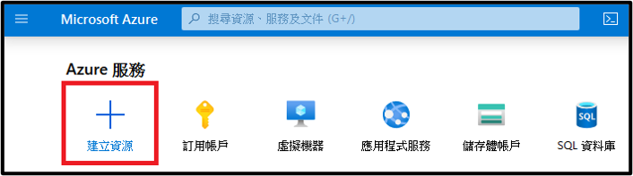
  
  2. 搜尋 Resource Group。
  
  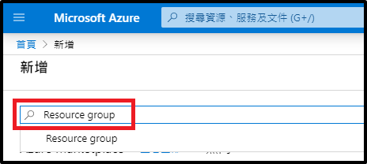
  
  3. 點選建立。
  
  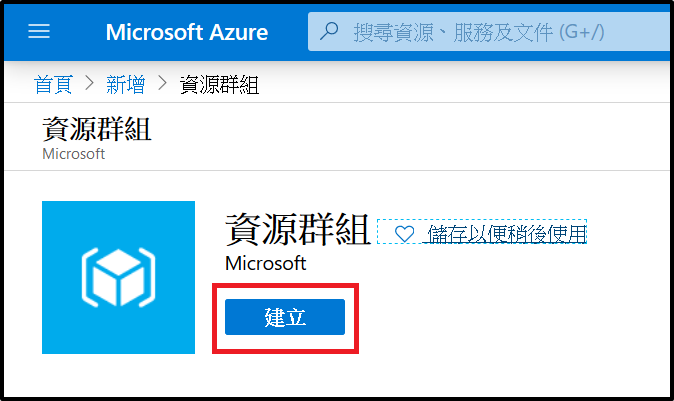

  4. 選擇訂用帳戶、資源群組命名、選擇區域並點選檢閱+建立。
  
  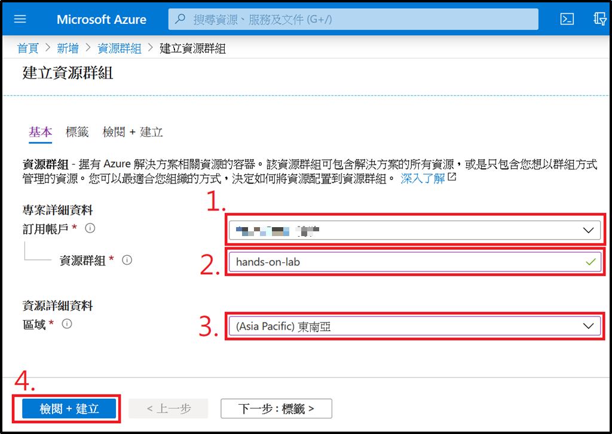

  5. 點選建立。
  
  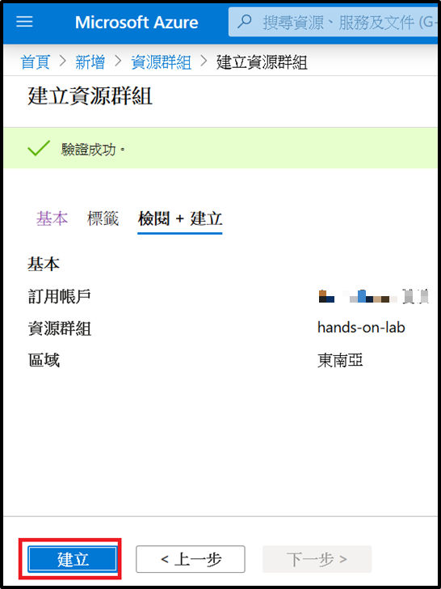

### 任務 2: 註冊Microsoft DataMigration resource provider
  1. 在 [Azure portal](https://portal.azure.com/) 中，點選訂用帳戶。

  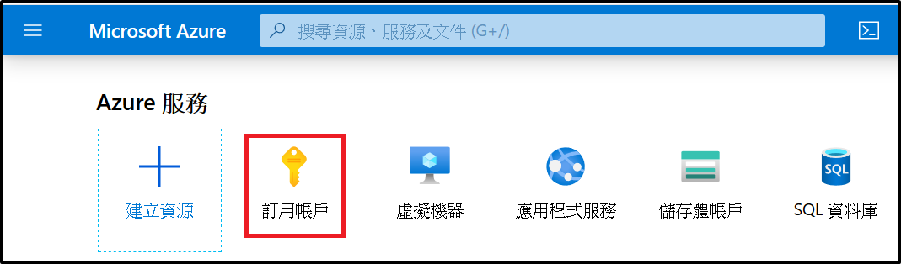

  2. 點選用於本次LAB的訂用帳戶。

  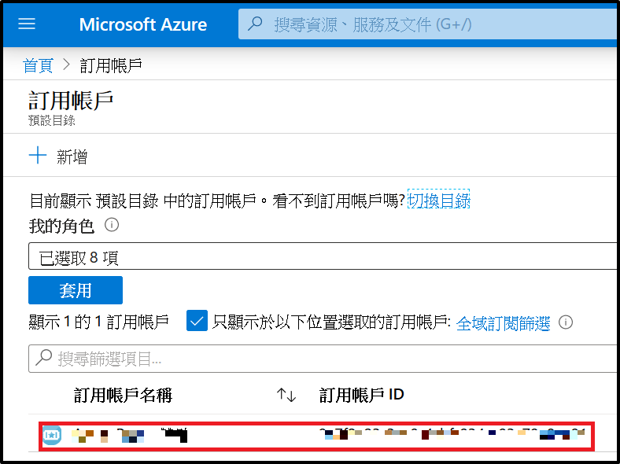

  3. 點選資源提供者、搜尋 migration、點選 Microsoft.DataMigration、點選註冊。

  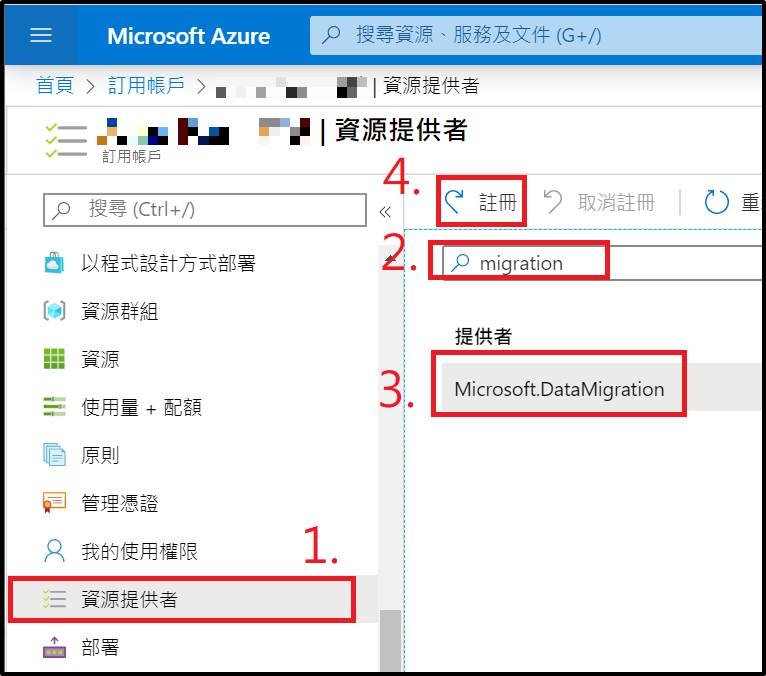

  4. 完成註冊需要幾分鐘的時間，再繼續下個步驟前請確定狀態已完成。

  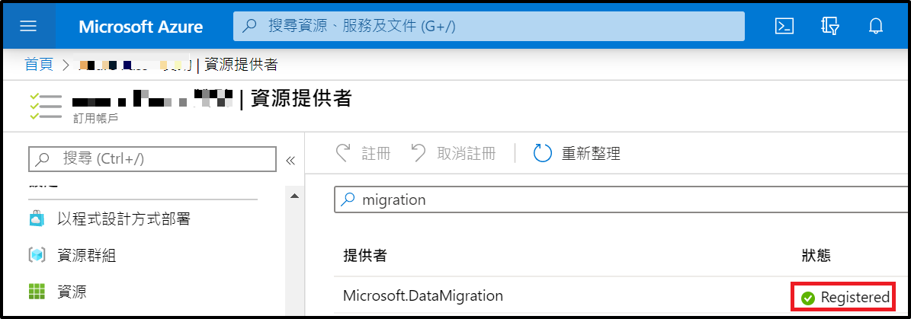

### 任務 3: 執行 Azure Resource Manager (ARM) template 建立資源

在此任務中，將執行 Azure Resource Manager (ARM) template 建立LAB所需資源，這些組件將被部署在新的虛擬網路(Virtual Network, VNet)中，並以此來維持 VMs 與 SQL MI 之間的通訊。此 ARM template 也將輸入輸出的安全路由加入網路安全群組，包含開啟 3389 Port 以允許遠端桌面協議 (Remote Desktop Protocol, RDP) 連接到跳板機(JumpBox)。除了創建資源之外，ARM template 也會執行 Power Shell 為每台虛擬機器安裝軟體和配置伺服器。

ARM template 建立的資源包含：

* 具有三個子網路的虛擬網路、Management、閘道子網 (Gateway subnet)
* 一個與 Gateway subnet 關聯的虛擬網路閘道 (Virtual Network Gateway)
* 一個路由表 (route table)
* 一個 Azure SQL Database 受控實例 (SQL MI)，加入至受管理的子網
* 一個裝有 Visual Studio 2019 Community Edition 與 SQL Server Management Studio (SSMS)，加至受管理的子網
* 一個 已安裝 SQL Server 2008 R2、Data Migration Assistant (DMA) 的虛擬機器，加入至受管理的子網
* Azure Database Migration Service (DMS)
* Azure App Service Plan and App Service (Web App)
* Azure Blob Storage account

1. 點選以下按鈕開始部署

 ***注意: ARM template 有時會導致 ResourceDeploymentFailure 錯誤，代碼為VnetSubnetConflictedWithIntendedPolicy 此錯誤不是由 ARM template 引起，為 Azure 後端數資源所閃生的問題，目前解決辦法為在其他區域部署資源。***

2. 在 Azuer 自定義部署頁面中點選編輯範本

3. 將 [template.json](./template.json) 覆蓋覆蓋原本的內容並點選儲存

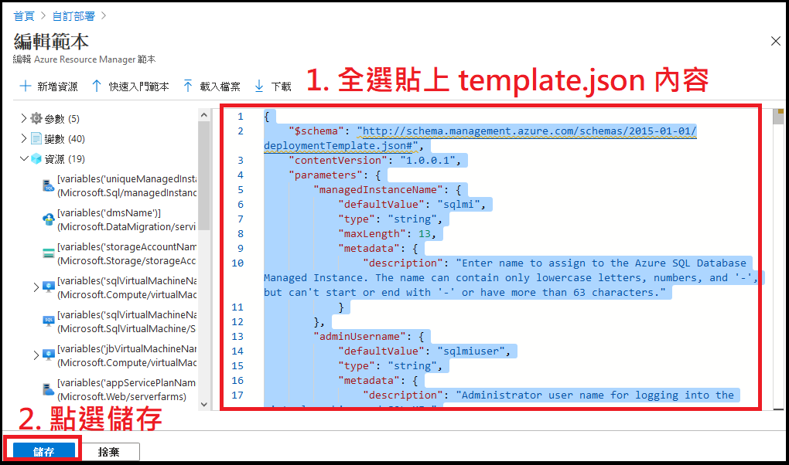

4. 在 Azuer 自定義部署頁面中輸入以下內容
- 訂用帳戶：選擇本次 LAB 使用的訂用帳戶。
- 資源群組：選擇本次 LAB 的資源群組 hands-on-lab。
- 位置：選擇本次 LAB 的資源群組位置
- 託管實例名稱：使用預設 sqlmi
- 管理員使用者名稱：使用預設 sqlmiuser
- 管理員密碼：使用預設 Password.1234567890
- 核心數： `調整為4`
- 儲存大小(GB)：使用預設32
- 勾選同意條款與條件

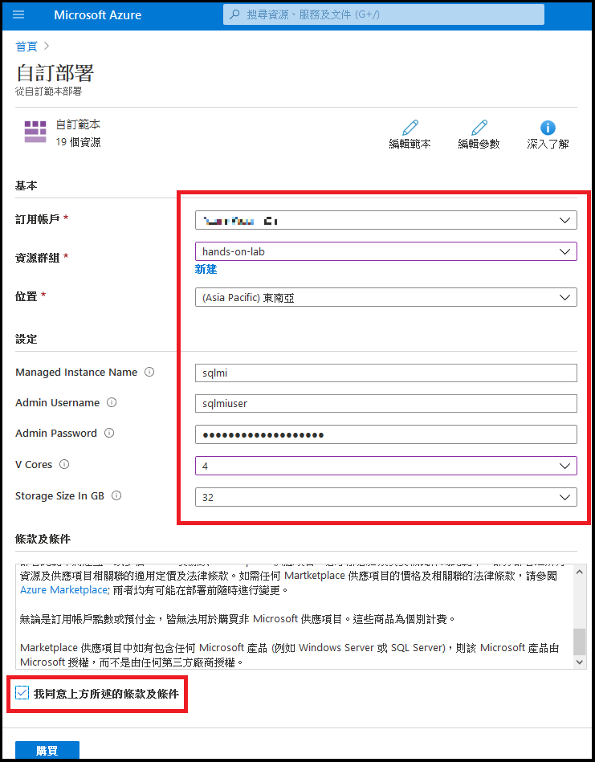

5. 選擇購買開始配置資源

***注意: 因為包含SQL MI，因此自定義的 ARM template的部署可能會達 6 小時以上，但其他大部分資源會在幾分鐘內完成。JumpBox和SQL Server 2008 R2 VM 約在15分鐘內完成***

6. 在資源群組中點選左側選單內的「部署」按鈕可監視部署進度，部署名為Microsoft.Template

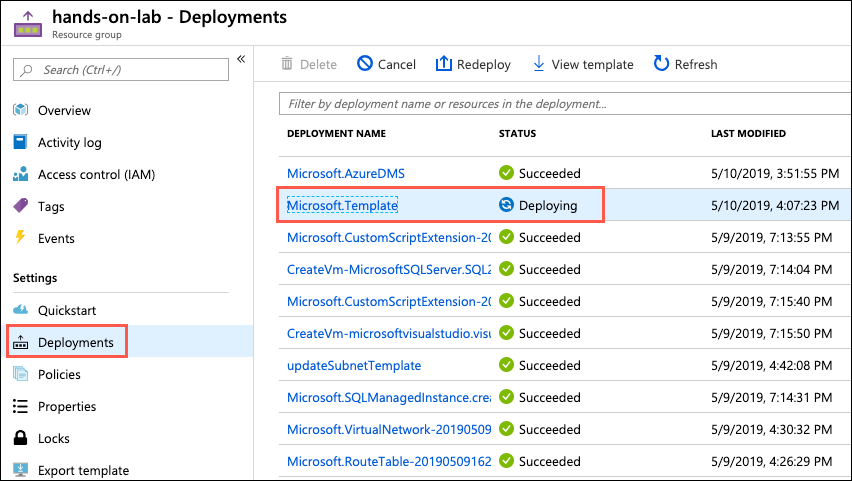

## 替 LAB 2 建立雲端的虛擬環境

### 任務 1: 部署本地環境
1. 將template SmartHotelHost.json 部署到新的資源群組。該 template 會部署一個執行 Hyper-V 的虛擬機，其中包含4個VM。透過以下按鈕部署 template。

- 選擇用於本次 LAB 的訂用帳戶。
- 需要建立一個新的資源群組，建議命名為SmartHotelHostRG。
- 位置選擇東南亞。
- 管理員使用者名稱：使用預設 demouser
- 管理員密碼：使用預設 demo!pass123
- 同意條款及條件

2. 選擇購買開始配置資源

### 任務 2: 驗證本地環境

1. 檢視由 template 部署的 SmartHotelHost VM
2. 記下公開IP
3. 在瀏覽器瀏覽 http://\<SmartHotelHost IP地址\>
4. 該應用程式正在 SmartHotelHost 的 Hyper-V 中的 VM 執行

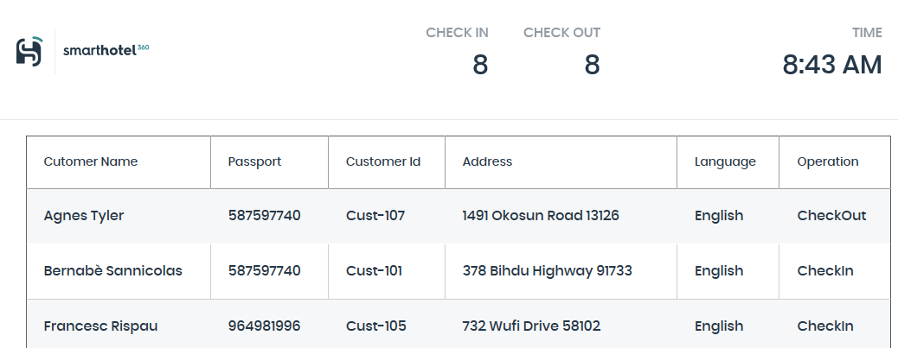